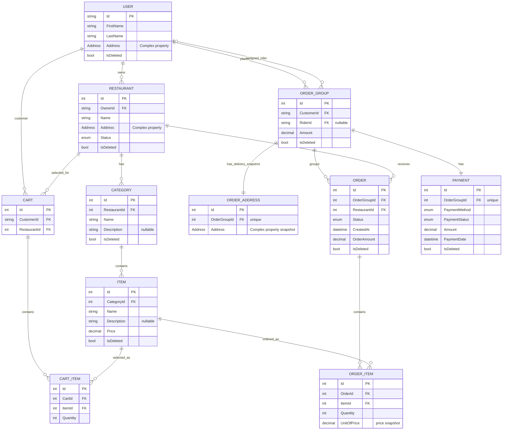

# TalabatClone — Project Guide and Restart Notes

This document describes the code contained in the `TalabatClone.Application.zip` archive reviewed on **October 6, 2026**. It is intended as a quick way to understand the repository after time away from the project.

> **Implementation status:** The solution contains the four planned projects and the complete first-pass domain model and database schema. The implemented application behavior is still early: the restaurant service is the only business service in the archive, and there are no API controllers yet. Treat the ERD as the intended data model represented by the current entities and migrations, not as proof that every workflow is implemented.

## 1. Project purpose

TalabatClone is an MVP food-ordering backend inspired by Talabat. Its planned workflow is:

1. A user browses restaurants, categories, and menu items.
2. A customer keeps separate carts for different restaurants.
3. Checkout turns each restaurant's cart into a separate `Order`.
4. Related restaurant orders are grouped under one `OrderGroup`, so one payment can cover the whole checkout.
5. A delivery rider can be assigned to the group later.

The code uses ASP.NET Core, Entity Framework Core, SQL Server, and ASP.NET Core Identity. The archive name mentions `Application`, but it contains the full solution, including Domain, Infrastructure, and Presentation projects.

## 2. Solution layout

```text
TalabatClone.slnx
├── TalabatClone.Domain/
│   ├── Entities/
│   ├── Enums/
│   └── TalabatClone.Domain.csproj
├── TalabatClone.Application/
│   ├── ApplicationServices/
│   ├── CustomExceptions/
│   ├── DTOs/
│   ├── Interfaces/
│   ├── MappingProfiles/
│   ├── Services/
│   └── TalabatClone.Application.csproj
├── TalabatClone.Infrastructure/
│   ├── Configurations/
│   ├── Database/
│   ├── Implementations/
│   ├── InfrastructureServices/
│   ├── Migrations/
│   └── TalabatClone.Infrastructure.csproj
└── TalabatClone.PL/
    ├── MiddleWarePipeline/
    ├── Properties/
    ├── Program.cs
    ├── appsettings*.json
    └── TalabatClone.WebAPI.csproj
```

`TalabatClone.slnx` is the solution entry point. All projects target **.NET 10** and enable nullable reference types and implicit usings.

### Domain

`TalabatClone.Domain` holds the business entities and enums. It contains the model for restaurants, catalog items, carts, orders, order groups, delivery addresses, and payments. `Address` is a value object reused by `User`, `Restaurant`, and `OrderAddress`.

`User` inherits from `IdentityUser`, so the Domain project references `Microsoft.Extensions.Identity.Stores`. This is a deliberate practical dependency, but it means the Domain project is not independent of framework libraries.

### Application

`TalabatClone.Application` contains contracts and orchestration:

- `Interfaces/Repos`: `IGenericRepo<T>` and the special `IUserRepo` contract.
- `Interfaces/UnitOfWork/IUnitOfWork.cs`: repository accessors and `SaveAllAsync`.
- `DTOs`: address and restaurant request/response models.
- `MappingProfiles/RestaurantProfile.cs`: AutoMapper mappings for addresses and restaurants.
- `Services/InterFaces/IRestaurantServices.cs`: restaurant use-case contract. The folder is spelled `InterFaces` in the repository.
- `Services/Implementation/RestaurantServices.cs`: current restaurant business logic.
- `CustomExceptions`: not-found and forbidden errors, plus a validation exception type.
- `ApplicationServices/AppServices.cs`: registers AutoMapper and `IRestaurantServices` with dependency injection.

The Application project references Domain and AutoMapper.

### Infrastructure

`TalabatClone.Infrastructure` implements persistence:

- `Database/TalabatDB.cs` extends `IdentityDbContext<User>`, exposes the application `DbSet`s, and applies entity configurations from the assembly.
- `Configurations/`: EF Core mappings for field lengths, decimal precision, complex properties, relationships, delete behavior, enum storage, and soft-delete filters.
- `Implementations/Repos/`: `GenericRepo<T>` and the Identity-key-aware `UserRepo`.
- `Implementations/UnitOfWork/UnitOfWork.cs`: lazily creates repositories and calls `SaveChangesAsync` through `SaveAllAsync`.
- `InfrastructureServices/InfraServices.cs`: registers SQL Server `TalabatDB` and `IUnitOfWork`.
- `Migrations/`: the initial schema migration, a follow-up FK delete-behavior migration, and the EF model snapshot.

Infrastructure references Application and Domain and uses EF Core SQL Server and Identity EF Core packages.

### Presentation layer (`PL`)

`TalabatClone.PL` is the ASP.NET Core Web API host. `Program.cs` configures infrastructure, application services, controllers, Swagger, HTTPS redirection, and authorization middleware. `MiddleWarePipeline/ExceptionHandlingMiddleware.cs` contains custom exception-to-HTTP response handling.

There are **no controller source files in the archive**. The project file has an empty `Controllers/` folder entry only. Therefore, the service methods are not currently exposed as HTTP endpoints.

## 3. Current data model and ERD

The entities and migrations define ten application tables (in addition to the Identity tables). Addresses are EF Core complex properties and are stored as columns on their owning rows; they are not separate address tables.



### Relationship notes

- One user can own multiple restaurants and have multiple carts and order groups. The code does not yet enforce that a user has a particular Identity role before using one of these relationships.
- Each cart points to one customer and one restaurant. The intended rule is one restaurant per cart; no cart workflow currently enforces the rule that each cart item belongs to that cart's restaurant.
- `CartItem` joins carts to menu items and stores quantity. It deliberately has no price snapshot; cart display is expected to use the current `Item.Price`.
- Each `Order` belongs to one `OrderGroup` and one restaurant. An order group may contain multiple restaurant orders.
- `OrderItem.UnitOfPrice` is the intended price snapshot, preserving the item's price at checkout time.
- `OrderGroup.RiderId` is nullable. A rider is optional and may be assigned after order creation. The EF configuration sets this FK to `NULL` when a rider user is deleted.
- `OrderAddress.OrderGroupId` and `Payment.OrderGroupId` have unique indexes in the initial migration, representing one delivery-address snapshot and one payment per group.
- `User.Address`, `Restaurant.Address`, and `OrderAddress.Address` are embedded complex properties. `OrderAddress` is separate so a later change to a user's current address does not change an existing delivery record.

## 4. Enums in the current code

These are the values found in `TalabatClone.Domain/Enums`:

| Enum | Current values | Storage configuration |
|---|---|---|
| `OrderStatus` | `Pending`, `Confirmed`, `Preparing`, `Ready`, `PickedUp`, `Delivered`, `Cancelled` | Stored as strings in `OrderConfiguration` |
| `RestaurantStatus` | `Busy`, `Opened`, `Closed` | Stored as strings in `RestaurantConfiguration` |
| `PaymentMethod` | `Cash`, `Visa` | Stored as strings in `PaymentConfiguration` |
| `PaymentStatus` | `Pending`, `Paid`, `Failed`, `Refunded` | Stored as strings in `PaymentConfiguration` |

The names differ slightly from the earlier planning notes (for example, `Opened` rather than `Open`, and `PickedUp` rather than `OnDelivery`). Use the code and current migration as the source of truth when continuing, and decide deliberately before renaming persisted enum values.

## 5. What is implemented today

### Restaurant application service

`RestaurantServices` currently supports:

- Create a restaurant after checking that the owner user exists. New restaurants start `Closed`.
- Get one restaurant by ID.
- Get all restaurants.
- Get restaurants for an owner.
- Update the name and address, after checking that the requesting user owns the restaurant.
- Update restaurant status, with the same ownership check.
- Soft-delete a restaurant by setting `IsDeleted = true`.

The service uses `IUnitOfWork` for repository access and AutoMapper for DTO/entity mapping. The corresponding DTOs and `IRestaurantServices` contract are present.

### Persistence and soft deletion

`GenericRepo<T>.Delete` sets `IsDeleted = true` when the entity implements `ISoftDeleted`; otherwise it physically removes the entity. `UserRepo.Delete` also sets the user's soft-delete flag. Query filters are configured for `User`, `Restaurant`, `Category`, `Item`, `Order`, `OrderGroup`, and `Payment`, so normal EF queries omit rows marked deleted for those types.

Not every entity is soft-deletable: `Cart`, `CartItem`, `OrderItem`, and `OrderAddress` do not implement `ISoftDeleted`. Their removal behavior follows EF/database relationships unless a workflow handles them explicitly.

### Database migrations

The archive contains two migrations:

1. `20260929201356_InitialMigration`: creates the Identity schema and the application tables, columns, indexes, and foreign keys.
2. `20261004150526_SecondMigration`: changes the `OrderGroup` customer FK to `Restrict` and the optional rider FK to `SetNull`.

The initial migration also contains unique indexes for `OrderAddresses.OrderGroupId` and `Payments.OrderGroupId`. A model snapshot is included. No migration is applied automatically in `Program.cs`.

## 6. Configuration and local setup notes

- The configured database provider is SQL Server.
- `TalabatClone.PL/appsettings.json` has a `Default` connection string pointing to a local SQL Server instance (`Server=.`) and database `TalabtCloneDB` (spelling as stored in the file), using Windows integrated security.
- `appsettings.Development.json` contains logging levels only; it does not override the connection string.
- `launchSettings.json` defines local HTTP and HTTPS profiles on ports `5213` and `7187`.
- Swagger is configured for development.
- The projects target .NET 10. The archive does not include a README, automated test project, test data, or a checked-in `global.json` SDK pin.

On another machine, check that .NET 10 and SQL Server are installed, review the connection string, restore packages, then build and run the solution. Apply EF migrations explicitly when the local database is ready. No build or runtime verification was performed as part of this documentation review.

## 7. Important unfinished areas and review notes

These points are based on the archived source and are useful to check before continuing:

1. **No API controllers exist yet.** Add controllers before expecting restaurant operations to be callable over HTTP. At present, `AddControllers()` and `MapControllers()` do not expose the restaurant service by themselves.
2. **Check exception middleware registration.** `Program.cs` calls `UseMiddleware<ExceptionHandlerMiddleware>()`, while the custom class in `MiddleWarePipeline/ExceptionHandlingMiddleware.cs` is named `ExceptionHandlingMiddleware`. `Program.cs` also imports `Microsoft.AspNetCore.Diagnostics`. Confirm which type is intended and register the custom middleware consistently.
3. **Check validation exception resolution.** `ExceptionHandlingMiddleware.cs` imports `System.ComponentModel.DataAnnotations`, while the project's own `TalabatClone.Application.CustomExceptions.ValidationException` is non-public. The `ValidationException` pattern in the switch may therefore refer to the framework type rather than the custom one. Make the intended exception type explicit and accessible if application services need to throw it.
4. **Identity/authentication setup is incomplete.** The context inherits `IdentityDbContext<User>`, and migrations include Identity tables, but `Program.cs` does not register Identity or authentication services, does not call `UseAuthentication()`, and there are no login/register endpoints or role setup in the archive. `UseAuthorization()` alone does not implement authentication.
5. **No role enforcement is present.** The data model uses one `User` type for owners, customers, and riders, but no current service checks Identity roles. Restaurant creation takes `OwnerId` as a service argument; an HTTP endpoint should eventually derive the caller identity from a validated token rather than trust an arbitrary client-supplied ID.
6. **Cart, checkout, orders, and payments are data-only so far.** There are no corresponding service contracts or business implementations in the archive. In particular, no transaction currently converts carts into order groups/orders/order items/payment, calculates totals, snapshots addresses, clears carts, or validates item/restaurant consistency.
7. **EF configurations are not equally explicit.** There are configurations for category, item, order address, order, order group, order item, payment, restaurant, and user. There are no dedicated cart/cart-item configuration files. Some relationships and delete rules therefore come from EF conventions; check the generated migration before changing the model.
8. **Soft-delete coverage and dependent behavior need decisions.** Query filters exist on several entities, but not on cart-related rows. The current migration uses cascade deletes for some relationships (including restaurant-to-category, category-to-item, and restaurant-to-order), while other relationships restrict deletion. Preserve order history intentionally when implementing deletion flows.
9. **The cart invariant is not enforced by the schema.** A cart records a restaurant and each cart item records an item, but there is no database constraint proving the selected item belongs to that cart's restaurant. Validate this in a cart service.
10. **Review constraints and DTO validation.** The restaurant DTO uses a string-length attribute, while several other expected validation rules (required values, positive prices/quantities, status transitions) are not implemented in this archive. Add validation in the appropriate layer as those workflows are introduced.

These are review findings, not evidence that the solution has been built or run. Confirm each item against the live repository before making a fix, since the ZIP is a point-in-time copy.

## 8. Suggested order for resuming development

1. Open the repository and confirm it matches this archive; keep or add this guide at the repository root.
2. Resolve the exception middleware type and exception namespace/accessibility issues, then build the solution to expose any additional compile-time problems.
3. Add and verify the first restaurant controller and request/response routes around the existing service.
4. Add API-level validation and a safe identity source for the requesting user; wire Identity/authentication before relying on role-based authorization.
5. Implement category and item services/controllers, including ownership checks and soft-delete behavior.
6. Implement cart operations and enforce the one-restaurant-per-cart and item-belongs-to-cart-restaurant rules.
7. Implement checkout as a transaction: create the `OrderGroup`, address snapshot, one order per restaurant, order-item price snapshots, and one payment; then clear or retire the carts.
8. Add order status transition rules, rider assignment, and authorization for customer, restaurant owner, and rider actions.
9. Add automated tests for ownership, soft deletion, cart invariants, price snapshots, multi-restaurant checkout, payment uniqueness, and status transitions.
10. Update EF configurations and create migrations whenever the persisted model changes. Review the migration before applying it to a database with data.

## 9. A quick mental model

- **Domain** says what the system's entities and states are.
- **Application** says what a user can do and coordinates those actions through interfaces.
- **Infrastructure** implements data access and database mappings.
- **PL** is intended to expose the application over HTTP and translate errors into HTTP responses.
- **`OrderGroup`** is the customer checkout/payment/delivery container; **`Order`** is the restaurant-specific part of that checkout.
- **`OrderItem.UnitOfPrice`** and **`OrderAddress.Address`** preserve historical checkout facts even if menu prices or the user's address change later.

